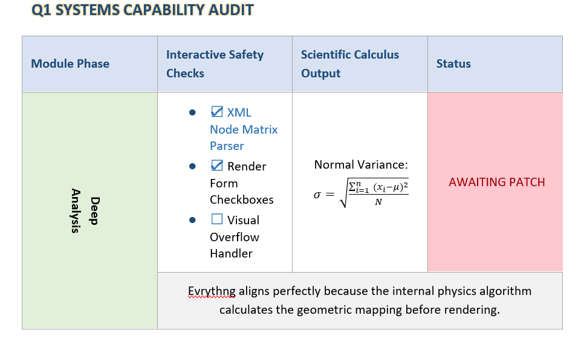

# 🚀 KritiDocX 0.1.0.dev6

[](https://www.python.org/)
[](https://github.com/)
[](https://deepmind.google/technologies/gemini/)
[](LICENSE)

**KritiDocX** is a powerful, industrial-strength **"Document Compiler"** designed to convert complex HTML and Markdown into high-fidelity Microsoft Word (`.docx`) reports.

Unlike simple converters, KritiDocX rebuilds the document structure natively, treating Word elements as objects with precise geometry, physics, and styling logic.

---

## ✨ The 'Zero-Code' Miracle
> **"Necessity is the mother of invention, and AI is the architect."**

This project has a unique origin story. It was conceptually architected and deployed by a creator from a **Non-Coding Background** within just **30 Days**, collaborating exclusively with **Google AI Studio**.

Every line of code—from the Matrix Engines to the XML Injectors—is a testament to human vision guiding artificial intelligence to build software engineering masterpieces.

---

## 📸 The "One-Page" Capability Showcase
*(This entire Word document was compiled dynamically from a single HTML string, generating Native Matrix Tables, Floating Rotated Shapes, and Editable Checkboxes & Equations.)*

<div align="center">
  
</div>

---


## 🌟 Key Capabilities

### 1. 🏗️ Hybrid Layout Engine (Layouts that Work)
*   **CSS to Word Translation:** Converts `float`, `absolute`, `relative`, and even `transform: rotate(..)` into Word's VML/DrawingML native anchors.
*   **Flex-like Behavior:** Intelligently handles Headers/Footers using auto-adjusting Grids to simulate CSS Flexbox layouts (Space-Between, Center).
*   **Section Control:** Manages Landscape/Portrait mixes, Page Breaks, and Column Splits dynamically within a single document.

### 2. 🔢 The Matrix Engine (Complex Tables)
*   **Grid Solver:** Most converters fail at `rowspan` and `colspan` conflicts. KritiDocX calculates a mathematical 2D matrix before rendering to handle complex merged cell geometries perfectly.
*   **Conflict Resolution:** Handles CSS border collisions (e.g., Red Border vs. Black Grid) using smart source prioritization.

### 3. 🧮 Scientific & Mathematical Core (OMML)
*   **Native Rendering:** Converts LaTeX equations (e.g., `$$ E=mc^2 $$`) directly into Microsoft Word **OMML** objects using XSLT transformations. No low-quality images!
*   **Latex Parser:** Sanitizes input and expands Matrix syntax (`bmatrix`, `pmatrix`) for scalable bracket rendering.

### 4. 🎨 Advanced Visual Styling
*   **Typography:** Support for Kerning, Text-Shadow, Reflection, Glow, and Gradient Text effects.
*   **Language Aware:** Smart font handling for Hindi (Mangal), Asian (SimSun), and Complex Scripts alongside English.
*   **Box Model:** Deep understanding of Margins, Padding, Borders, and Background Shading at both Block (Paragraph) and Inline (Span) levels.

### 5. 🎛️ Interactive Form Elements
*   **Functional Controls:** Renders real MS Word Interactive Controls (SDT):
    *   Clickable Checkboxes (☑ / ☐)
    *   Dropdown Selection Lists
    *   Date Pickers
    *   Input Fields with Placeholders

---

## 🛠️ Project Structure

The project follows a decoupled **"Router-Controller-Factory"** pattern:

```text
KritiDocX/
├── kritidocx/
│   ├── core/           # 🧠 Router & Pipeline (The Brain)
│   ├── objects/        # 🧱 Domain Logic (Tables, Media, Math, Forms)
│   ├── xml_factory/    # 🏭 Low-Level OOXML Generation (The Hands)
│   ├── basics/         # 📏 Physics Engine (Units, Colors, Borders)
│   ├── css_engine/     # 🎨 Style Parser
│   └── parsers/        # 📖 HTML & Markdown Readers
├── inputs/             # 📂 User Templates
└── output/             # 📤 Generated Documents
```

---

## 🚀 Quick Start

### Installation
Ensure you have Python 3.8+ installed.

```bash
pip install kritidocx
```

---

## 💻 How to Use: The 4 Core Modes

KritiDocX features a beautifully simple **Facade API**. You only ever need to call one function: `convert_document()`. The engine automatically figures out what to do based on what you feed it.

### Mode 1: The Simple Converter (HTML or Markdown)
Got a single file? Pass it in. The engine auto-detects `.html` or `.md` and applies the perfect parsing strategy.

```python
from kritidocx import convert_document

# Automatically handles HTML Layouts and Inline CSS
convert_document(
    input_file="report.html", 
    output_file="Corporate_Report.docx"
)

# Works just as well with Markdown containing Math and Tables!
convert_document(
    input_file="research_paper.md", 
    output_file="Physics_Paper.docx"
)
```

### Mode 2: The "Hybrid Template" Engine 👑 *(Signature Feature)*
This is where KritiDocX shines. Separate your **Design (HTML)** from your **Data (Markdown)**. 
The engine will look for `<div id="content"></div>` or `<main>` in your HTML file and safely inject your rendered Markdown data straight into the MS Word flow, inheriting all parent CSS styles!

```python
from kritidocx import convert_document

convert_document(
    input_file="company_letterhead.html", # The Design Wrapper
    data_source="weekly_data.md",         # The Dynamic Content
    output_file="Hybrid_Output.docx"
)
```

### Mode 3: Magic Assets Handling (Images & Math)
**Zero Extra Code Required!** KritiDocX does this automatically behind the scenes.
Just include them in your source `HTML/MD` files:

*   **Remote Images:** `` *(Auto-downloads & caches!)*
*   **Base64 Strings:** ``
*   **Scientific Equations:** `$$ E = \frac{mc^2}{\sqrt{1-v^2/c^2}} $$` *(Compiles to Native Word OMML!)*

```html
<!-- Put this in your HTML. KritiDocX handles the network and placement math automatically. -->
<p>
    Figure 1.0 <br>
    
</p>
```

### Mode 4: Power User Overrides (Configuration)
Want to enable detailed debug logs, change network timeouts, or let the pipeline ignore minor formatting errors? Just pass a `config` dictionary!

```python
from kritidocx import convert_document, KritiDocXError

# Customize the Engine Behavior
engine_settings = {
    "DEBUG": True,                 # Shows a beautifully nested color-coded terminal log
    "CONTINUE_ON_ERROR": False,    # Will halt on the first crash (Strict Mode)
    "REQUEST_TIMEOUT": 20          # Wait longer for big images to download
}

try:
    success = convert_document(
        input_file="heavy_data.html",
        output_file="Result.docx",
        config=engine_settings     # <--- Pass settings here!
    )
    if success: print("Success!")

except KritiDocXError as e:
    # Safely catch specific library crashes without blowing up your entire app
    print(f"Engine Alert: {e}")
```

---

## 🛠️ The Architecture Explained

Ever wonder why standard HTML converters mess up page layouts and table borders? 

Most libraries just paste HTML onto a blank Word canvas. **KritiDocX compiles it.** 

When you run `convert_document()`:
1. **The Parsers** clean your code (stripping out JavaScript and invisible unicode garbage).
2. **The Math Engine** translates `LaTeX` logic and replaces raw text with `<m:oMath>` OpenXML structures.
3. **The Geometry Solver (Matrix Engine)** plots your HTML tables on a 2D Matrix to resolve nested `colspan/rowspan` and calculates exact 'Twip' capacities for margins.
4. **The XML Factory** safely generates exact ECMA-376 compliant Office XML schema ordered lists.

Your output is indistinguishable from a document manually created by an expert using Microsoft Word!

---

## 🖼️ Example Scenarios

### 1. Complex Header (CSS Grid/Flex Emulation)
```html
<header style="display: flex; justify-content: space-between;">
    <div style="width: 50%">COMPANY LOGO</div>
    <div style="text-align: right">DATE: 2026-03-08</div>
</header>
```
*KritiDocX converts this into a invisible Grid Table to ensure perfect alignment.*

### 2. Math Equation (Scientific)
```html
<p>
    Calculation: $$ x = \frac{-b \pm \sqrt{b^2 - 4ac}}{2a} $$
</p>
```
*Renders as a native editable Word Equation object.*

### 3. Checkbox Logic
```html
<input type="checkbox" checked style="color: blue;"> Approved
```
*Renders as a clickable MS Word Form Checkbox styled in Blue.*

---

## 🤝 Contribution & License

This project is open-sourced under the **MIT License**.
Contributions, issues, and feature requests are welcome!

**Author:** KritiDocX Team
**Created with:** Passion, Curiosity, and Google AI Studio.

---

## ❤️ Support the Project
**KritiDocX** is an open-source project built with passion and hundreds of hours of AI-orchestration. If this library saved your time or helped your business, consider buying me a tea! Your support helps keep the engine running and fuels the development of future features.

[](https://ko-fi.com/kritidocx)

---